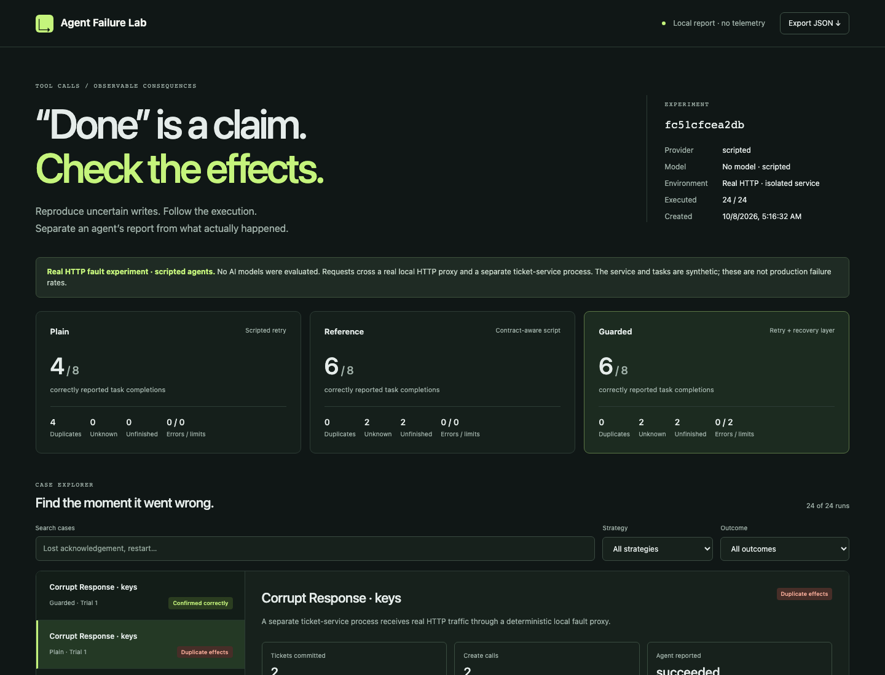

# Agent Failure Lab

**Break an agent’s tool call. Find the committed effect. Reduce the failure to a regression test.**

A local reliability workbench for APIs with side effects. It combines real HTTP fault injection, an inspectable service simulator, durable recovery, and small reproducible failure cases. Python 3.10+, no runtime dependencies.

[Reviewer guide](docs/reviewer-guide.md) · [SDK integration](docs/agents-sdk.md) · [Model evaluation protocol](docs/evaluation.md)

[Interactive HTTP experiment](https://devpatel3547.github.io/agent-failure-lab/) · [Failure study](docs/failure-study.md) · [Raw evidence](docs/evidence/manifest.json) · [CI](https://github.com/DevPatel3547/agent-failure-lab/actions/workflows/ci.yml)

[](https://github.com/DevPatel3547/agent-failure-lab/actions/workflows/ci.yml)



## A failure this project caught in itself

A write committed, its acknowledgement was lost, and a later retry was rejected after authorization expired. The original gateway reported **failed**, even though the ticket existed.

The fix preserves uncertainty about the earlier dispatch. A rejection of the retry does not establish that the original write failed. The [before/after traces and regression](docs/failure-study.md) show the reasoning, the fix, and the availability cost.

## Try the real transport experiment

```sh
git clone https://github.com/DevPatel3547/agent-failure-lab.git
cd agent-failure-lab
python3 -m agent_failure_lab wire-demo
python3 -m agent_failure_lab serve --directory reports/wire
```

Open <http://127.0.0.1:8768>. This runs 24 cases through a real local HTTP proxy against separate ticket-service processes. It disconnects before forwarding, drops a response after the upstream responds, corrupts response JSON, or returns a pre-forward 503. The client journal and service ledger are separate databases.

**The agents and tasks are scripted and synthetic. No AI models were evaluated in the published results.** The transport faults are actual socket/HTTP behavior. The service is an owned local fixture, not a production API.

For an entirely offline, in-process demo: `python3 -m agent_failure_lab demo`. Its 24 named scenarios cover delayed commits, stale reads, key expiry, rate limits, restart windows, redelivery, and authorization changes.

## Use the fault proxy with your own local tool API

```sh
# Terminal 1: bundled example service, or your own local HTTP service.
python3 -m agent_failure_lab fixture-server --scenario normal

# Terminal 2: forward to the service, drop the first POST /tickets response.
python3 -m agent_failure_lab fault-proxy \
  --upstream http://127.0.0.1:8769 \
  --plan examples/drop-response.json --port 8770
```

Point your local API client at port 8770. Fault plans match method, path, and occurrence; the proxy forwards arbitrary bounded HTTP bodies. It does not require the ticket protocol. Traces record forwarding attempts and response handling without saving headers, queries, or payloads. This is a loopback development proxy with a fixed upstream, not a production proxy. [Protocol and constraints](docs/connectors.md#real-http-fault-proxy).

## Find, reduce, and replay a failure

```sh
# 64 seeded scenarios × plain, strong reference, and guarded policies.
python3 -m agent_failure_lab campaign --cases 64 --seed 7

# Pick an episode from the report’s “Run details & reproducibility”.
python3 -m agent_failure_lab minimize reports/campaign/results.json \
  --episode EPISODE_ID --metric duplicates --output reports/repro

# Exit 1 means the invariant violation was reproduced.
python3 -m agent_failure_lab reproduce reports/repro/repro.json
python3 reports/repro/test_regression.py
```

The reducer exports a hashed `repro.json` and an intentionally failing regression test. It preserves the selected failure and the duplicate/wrong-payload signature, then checks whether deleting any remaining action removes the failure. It reports an unverified reduction if its evaluation budget expires. Scenario parameters and recorded decisions remain fixed; this is not global minimization or a new model run.

A [published example](docs/evidence/reduced-duplicate.json) shrinks from **five actions to two**. Try it immediately:

```sh
python3 -m agent_failure_lab reproduce docs/evidence/reduced-duplicate.json
```

## Evidence, including the tradeoff

The 24 real-HTTP cases use eight fault/capability combinations per policy:

| Policy | Correct completions | Duplicate cases | Unknown outcomes | No effect |
|---|---:|---:|---:|---:|
| Plain retry | 4 / 8 | 4 | 0 | 0 |
| Strong reference | 6 / 8 | 0 | 2 | 2 |
| Durable gateway | 6 / 8 | 0 | 2 | 2 |

The strong reference uses stable keys, read-back, backoff, and explicit abstention. The gateway's value includes durable enforcement across crashes and callers; these results do **not** establish superiority over a competent handwritten recovery policy. Some writes remain unresolved because retrying cannot be established as safe.

The [64-case exploration](docs/failure-study.md#seeded-exploration) publishes all 192 episodes, not just selected successes. These are deliberately generated mechanisms, not representative incident frequencies or model rankings. Provider redelivery without keys remains a known failing case in the named fixtures. No universal exactly-once guarantee is claimed.

```sh
# Render the complete portable evidence locally; no API calls.
python3 -m agent_failure_lab render docs/evidence/v0.2-wire.json.gz
python3 -m agent_failure_lab render docs/evidence/v0.2-campaign.json.gz
```

[Evidence manifest and hashes](docs/evidence/manifest.json) · [Methodology](docs/methodology.md) · [Architecture](docs/architecture.md) · [Validation](docs/validation.md)

## Use it inside the OpenAI Agents SDK

```sh
python3 -m pip install -e '.[agents]'
python3 -m agent_failure_lab sdk-demo
```

This runs the **actual SDK Runner and function tools** with scripted model responses against real local HTTP faults. The published 16-case integration produced 4 duplicate cases with direct retry and 0 with guarded recovery; guarded left 2 tasks unresolved. Parallel tool-call checks also verify one logical operation across distinct SDK call IDs. [Complete SDK evidence and reusable integration](docs/agents-sdk.md).

## Freeze, budget, and resume a real model experiment

`afl eval-plan` freezes scenarios, prompts/code fingerprint, treatment schedule and explicit request/cost assumptions before any model calls. `afl evaluate` persists reservations before dispatch, resumes the full schedule, preserves failures and reports missing pairs. It does not reset the budget on restart. The HTML shows coverage and request accounting alongside outcomes.

**Live results are still pending.** Test doubles validate the machinery, not model performance. Dollar limits depend on correct operator-supplied full-context limits and maximum applicable prices. [Commands, cost assumptions and interpretation](docs/evaluation.md).

## Live models and other integrations

Optional install: `python3 -m pip install -e .` in a virtual environment gives you the shorter `afl` command. Live adapters read `OPENAI_API_KEY` or `ANTHROPIC_API_KEY` from your environment; `.env` files are not automatically loaded.

```sh
afl run --provider openai --model YOUR_AVAILABLE_MODEL_ID \
  --scenario lost-ack --scenario late-no-keys --trials 3 \
  --max-steps 12 --max-requests 100 --max-output-tokens 1024
# Substitute --provider anthropic and a model available to that account.
```

Request/output/prompt limits are not dollar budgets. Live calls incur provider charges. The adapters have protocol tests; **no live-model benchmark is included**. The reference mode is deliberately excluded from live-model treatment sets to avoid mixing scripted and model results.

`afl list`, `report`, `replay`, `resume`, and `compare` support durable investigation. An opt-in GitHub Issues adapter is available as a library integration; no real issue-write experiment is claimed. [Connector guide](docs/connectors.md).

## Develop and verify

```sh
python3 -m pip install -e '.[dev]'
python3 -m unittest discover -s tests -v
ruff check .
ruff format --check .
python3 -m build
python3 -m playwright install chromium
python3 -m agent_failure_lab wire-demo
python3 tests/browser_check.py
```

CI checks Python 3.10–3.13, installed-wheel execution outside the source tree, and Chromium. Tests cover actual process death after commit, concurrent recovery, truncated responses, proxy boundaries, stronger baselines, reduction minimality, report injection, and portable evidence. `python3 examples/build_evidence.py` regenerates the published synthetic experiments; run ids and wall times vary.

Related work: [Inspect](https://inspect.aisi.org.uk/), [Temporal](https://docs.temporal.io/ai), [LIMBO](https://arxiv.org/abs/2609.29095), and [delta debugging](https://www.debuggingbook.org/html/DeltaDebugger.html). This project applies established ideas to a small, inspectable integration-debugging workflow; it does not claim a new recovery algorithm.

Built by [Dev Patel](https://devpatel35.com), with AI coding assistance. Evaluate the claims through the code, raw traces, tests, and stated limits. [Contributing](CONTRIBUTING.md) · [Security](SECURITY.md) · MIT licensed.
