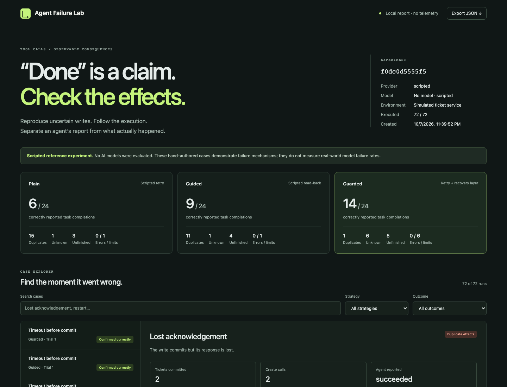

# Agent Failure Lab

**A tool said “timeout.” Did the write fail, succeed, or finish later?**

Agent Failure Lab reproduces that ambiguity, records what an agent observed, and checks what the service actually committed. It is a small, inspectable debugging workbench for engineers building agents that call APIs with side effects.

[](https://github.com/DevPatel3547/agent-failure-lab/actions/workflows/ci.yml)



## Try it in a minute

Python 3.10+; **no runtime dependencies, API key, or network needed** for the demo.

```sh
git clone https://github.com/DevPatel3547/agent-failure-lab.git
cd agent-failure-lab
python3 -m agent_failure_lab demo
python3 -m agent_failure_lab serve
```

Open <http://127.0.0.1:8768>. Or open `reports/latest/index.html` directly; it is a standalone file with embedded data, CSS, and JavaScript.

Optional installation in a virtual environment:

```sh
python3 -m venv .venv
source .venv/bin/activate
python -m pip install -e .
afl demo
```

**The default demo uses transparent scripts, not AI models.** Its results demonstrate failure mechanisms in deliberately selected fixtures. They are not model rankings or estimates of real-world failure rates.

## What works today

- **24 fault scenarios:** lost acknowledgements, timeouts before commit, delayed commits, stale reads, unsupported or expired idempotency keys, provider redelivery, rate limits, rejected writes, unavailable lookups, worker restarts, and expired authorization.
- **Three strategies:** plain decisions, recovery guidance, and plain decisions behind a durable recovery gateway. The scripted guided baseline only adds read-back; live guided runs receive richer recovery instructions.
- **Independent grading:** duplicate effects, missing effects, wrong payloads, false success, false failure, unresolved outcomes, and correctly reported completion.
- **Durable recovery:** SQLite intent records before dispatch, stable provider keys, reconciliation, conservative retry refusal, rate-limit backoff, and resumable episode checkpoints.
- **Live model adapters:** OpenAI Responses and Anthropic Messages, explicit model selection, request/output/prompt limits, token accounting, strict action validation, and no automatic HTTP retries.
- **Portable investigation:** searchable trace viewer, separate world/grader reveal, action replay, JSON export, and paired regression checks.
- **Connector examples:** a real loopback HTTP fixture service and an opt-in GitHub Issues adapter. The built-in experiments grade simulated services; they do not automatically run writes against GitHub.

## A concrete failure

```text
Agent -> create ticket -> service commits T-1 -> acknowledgement is lost
Agent <- timeout
Agent -> retries       -> service commits T-2
Agent <- created T-2   -> reports success
Grader -> two effects  -> duplicate + false success
```

A stable key can let the service return T-1 on retry. Without that contract, the gateway first looks for the earlier effect. If lookup cannot establish the outcome, it refuses an uncertain unkeyed retry. That can leave a task unresolved or missing. **There is no universal exactly-once guarantee here.** Provider-side duplication without idempotency remains a failing case.

## Run a live model

Set the relevant API key in your local shell or secret manager. Keys are read from `OPENAI_API_KEY` or `ANTHROPIC_API_KEY`; `.env` files are not loaded automatically.

```sh
afl run --provider openai --model YOUR_AVAILABLE_MODEL_ID \
  --scenario lost-ack --scenario late-no-keys \
  --trials 3 --max-steps 12 --max-requests 100 \
  --max-output-tokens 1024 --max-prompt-bytes 64000 \
  --output reports/openai

# Same interface for Anthropic:
afl run --provider anthropic --model YOUR_AVAILABLE_MODEL_ID \
  --scenario lost-ack --max-requests 30 --output reports/anthropic
```

Live runs incur provider charges. Limits bound requests and output size, **not a dollar amount**; pricing depends on the explicit model. A partial experiment is labeled incomplete and exits with code 2 when an API error or request budget stops it. Every model turn receives a fresh structured request containing its full public history. This harness does not preserve private reasoning between API calls.

The adapters have automated request/response contract tests. **No live model benchmark is included in this release**, and the GitHub adapter has not been validated by creating real issues. See [validation and limitations](docs/validation.md).

## Investigate and reproduce

```sh
afl scenarios
afl demo --scenario lost-ack --modes plain guarded --output reports/one-case
afl list
afl report EXPERIMENT_ID --output reports/rebuilt

# Episode ids appear under “Run details & reproducibility” in the report.
afl replay reports/latest/results.json --episode EPISODE_ID

# Resume one episode interrupted by a killed process; finalized episodes use replay.
afl resume EPISODE_ID
# For a live episode, repeat its original --provider and --model.

# Exit 1 on regression; exit 2 on incompatible/incomplete inputs.
afl compare reports/before/results.json reports/after/results.json
```

Replay re-executes recorded actions against a fresh world and compares effect metrics. It does not ask a model to reproduce its decisions. Experiment order is seed-controlled; fixture hashes and provider/model identity are saved. [Methodology](docs/methodology.md) explains the scoring, ablations, and reproducibility boundaries.

## Use a real HTTP boundary

```sh
afl fixture-server --scenario lost-ack
# Another terminal:
afl probe http://127.0.0.1:8769
python examples/http_recovery.py
```

The example sends actual HTTP requests to the local fixture server through the same recovery gateway. The mock service persists between restarts. Use a fresh `--namespace` or database for a fresh case. [Connector guide](docs/connectors.md) covers the protocol and the opt-in GitHub adapter.

## Develop

```sh
python3 -m unittest discover -s tests -v
python3 -m pip install -e '.[dev]'
ruff check .
ruff format --check .
python3 -m build
python3 -m playwright install chromium
python3 tests/browser_check.py
```

The tests include real process termination after external commit, concurrent workers, all-fixture replay, provider protocol validation, HTTP round trips, redaction, and report injection protection. Browser checks exercise filtering, hidden-state disclosure, trace scrubbing, export, and mobile layout. CI tests Python 3.10–3.13 and the report in Chromium.

## Why this exists

A useful agent integration needs more than a plausible final answer. It needs evidence about external state when requests fail halfway through. This project makes a narrow slice of that problem reproducible and inspectable.

This is an engineering workbench, not a claim of a new recovery algorithm or a new scientific benchmark. Relevant prior work includes [Inspect](https://inspect.aisi.org.uk/), [Temporal’s durable execution tools](https://docs.temporal.io/ai), and [LIMBO](https://arxiv.org/abs/2609.29095). The [architecture](docs/architecture.md) documents the chosen scope and tradeoffs.

Built by [Dev Patel](https://devpatel35.com). AI coding assistance was used during development; claims should be evaluated through the implementation, tests, and documented limits. Contributions are welcome through [small reproducible cases](CONTRIBUTING.md). MIT licensed.
