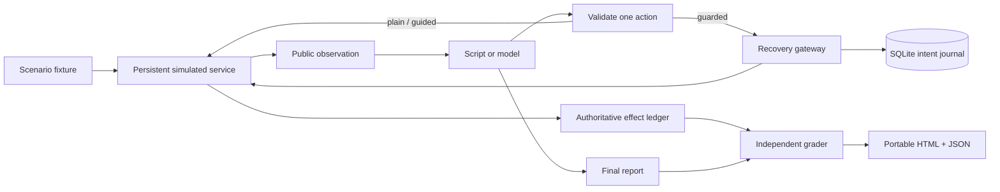

# Architecture and design decisions

## Boundaries

`schema.py` validates fixtures, tools, observations, and connector capabilities. `providers.py` builds API requests from only the task, public contract, public clock, remaining steps, and public history. The scenario name, fault schedule, actual effects, and grader results are excluded.

`runner.py` validates actions again, checkpoints before execution, routes actions through the selected strategy, and grades after delayed writes settle. `simulator.py` controls service time and records authoritative effects. The separation prevents an agent's “success” claim from becoming ground truth.

`storage.py` persists experiments, episodes, checkpoints, operation records, and simulator worlds in SQLite. Write transactions use `BEGIN IMMEDIATE`; WAL and busy timeouts support the tested concurrent-worker cases. Local database possession grants access to hidden state; this is not a sandbox for executing adversarial agent code.

## Why a small Python package

The fault model and recovery decisions are easier to audit without a large framework. Python's standard library supplies SQLite, HTTP transport, the CLI, and tests. The report is vanilla HTML/CSS/JavaScript with no remote assets. Setuptools is a build dependency, not a runtime dependency.

A logical clock makes delayed effects deterministic and removes sleep-based flakiness. That is a deliberate approximation: it does not measure real network timing, tail latency, distributed clock skew, or provider throughput.

## Recovery protocol

1. Check the requested title against the authorized task.
2. Persist an operation fingerprint and stable idempotency key before dispatch.
3. Return a previously confirmed/rejected result if one exists.
4. Honor a recorded rate-limit deadline before issuing another write.
5. For uncertain dispatches, reconcile through provider lookup when available.
6. If lookup is inconclusive and provider keys are supported within their lifetime, retry with the same key.
7. Otherwise return uncertainty and refuse another unkeyed write.

A crash between intent persistence and actual dispatch also produces uncertainty. This sacrifices availability to avoid duplicate writes when the provider cannot resolve ambiguity. A successful read-back is evidence of presence; a stale empty result is not evidence of absence.

The key lifetime check is conservative for the simulator's next logical tick. It does not establish safe retry deadlines on an arbitrary real network with unbounded latency. Production connectors need explicit expiry and transport assumptions.

The gateway cannot undo duplicate effects caused inside a non-idempotent provider, guarantee availability, enforce another service's authorization, or recover from a destroyed local journal. Operation ids must remain unique per logical task and stable through recovery. Reusing an id with a different payload is rejected.

## Restart semantics

The bundled restart fixture raises a controlled exception after dispatch and reopens persistent connector/gateway objects. Separate tests terminate an actual child process with `os._exit` after commit and resume against the same SQLite files. Neither simulates machine power loss, disk corruption, or a multi-host database failure.

The runner checkpoints its public history and pending action before invoking a tool. `resume` annotates an unacknowledged action as uncertain and continues the remaining step budget. It resumes one interrupted episode, not the rest of an entire scheduled experiment. Provider request budgets apply per invocation; an interrupted API request's token usage may be unavailable.

## Portable reports

Reports contain public observations, hidden effects, and a complete trace for investigation. The UI hides world/grader events by default, but they remain in the file. Reports must not be given to an agent as a blind evaluation prompt. Dynamic values are rendered as text and embedded JSON escapes HTML delimiters. Redaction is best effort; review reports before sharing real data.
